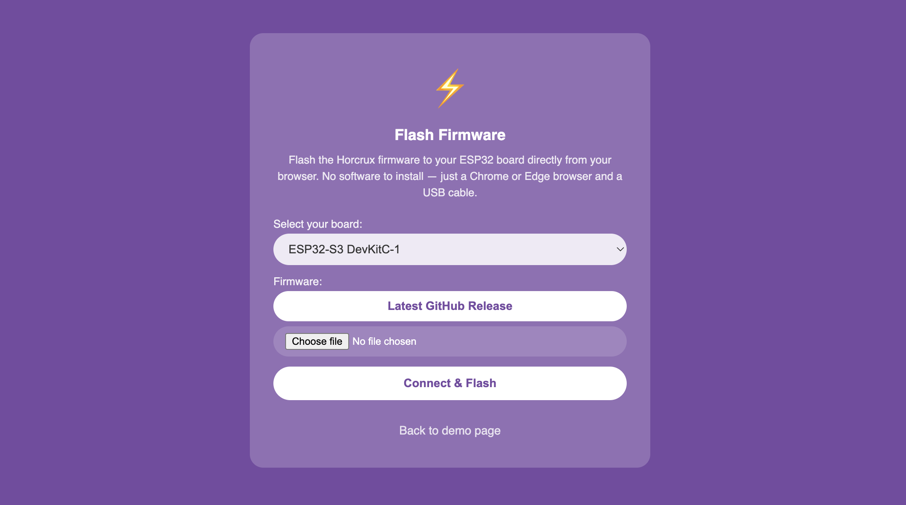

# 1. Setup the hardware

The microcontroller is the brain of your Horcrux device. It runs [horcrux-core](https://github.com/ficaud/horcrux-core), the firmware that powers it.

The following boards are currently supported:

- [ESP32-S3-DevKitC-1](https://docs.zephyrproject.org/latest/boards/espressif/esp32s3_devkitc/doc/index.html)
- [ESP32-DevKit-V1](https://docs.zephyrproject.org/latest/boards/others/doit_esp32_devkit_v1/doc/index.html)
- Support for more boards is on the way — check back soon...

> Note: These boards have been tested and are known to work with horcrux-core. There are probably more that work, but since they haven't been tested, they won't appear on the list.

> Note: For now, Horcrux requires boards that support Wi-Fi Access Point (AP) mode. Future versions may support other connection methods.

## How to get a microcontroller

These boards are widely available, so you shouldn't have any trouble finding one. You can order them from a specialized electronics retailer, buy them on the usual online marketplaces, or even pick one up at a physical store — whichever suits you best.

Here are a few sources worth checking out:

- [Amazon](https://www.amazon.com/)
- [Conrad](https://www.conrad.com/)
- [Mouser](https://www.mouser.com/)
- [Aliexpress](https://www.aliexpress.com/)
- [Digikey](https://www.digikey.com/)

## How to program the microcontroller

Head over to [horcrux flash](https://ficaud.github.io/horcrux-core/flash.html), select your board, and download the matching firmware. To make sure you get the latest version of horcrux-core, click on **Latest GitHub Release**.

Once the firmware is downloaded, you'll see a Qrcode that you can then scan with your phone to join the network.

More information about the flash process can be found [here](https://github.com/ficaud/horcrux-core/tree/dev/jfi#how-to-connect-to-captive-portal).

## Live demo

Here you can find a live demo showing you in video the exact steps that you need to follow to flash horcrux-core in your device.

TBD: add video

## Craft a nice enclosure

Once your Horcrux is up and running, I'd recommend crafting a nice enclosure for your microcontroller Not only does it protect the hardware, but it also keeps it from being mistaken for a leftover piece of electronics and thrown in the bin.

TBD: find a hackable way to do enclosure / or 3d print it.

## More links

- [Wikipedia ESP32](https://fr.wikipedia.org/wiki/ESP32)
- [Espressif (company that produces ESP32)](https://www.espressif.com/en/products/socs/esp32)
