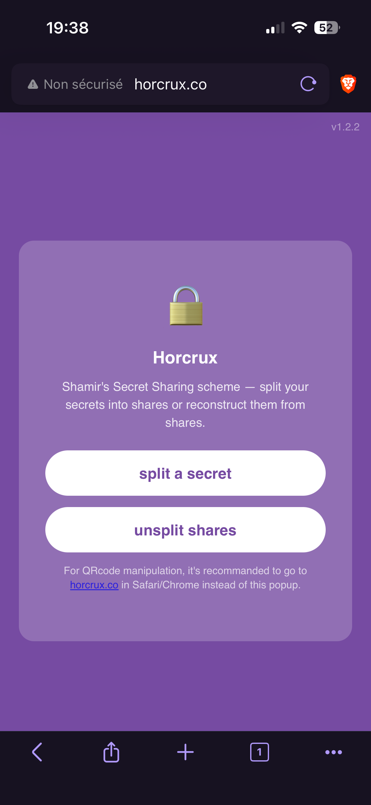
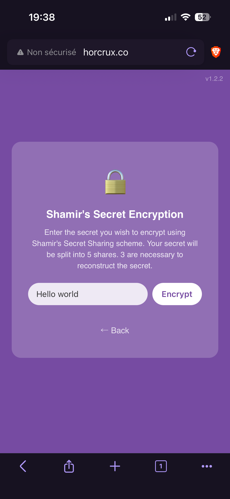
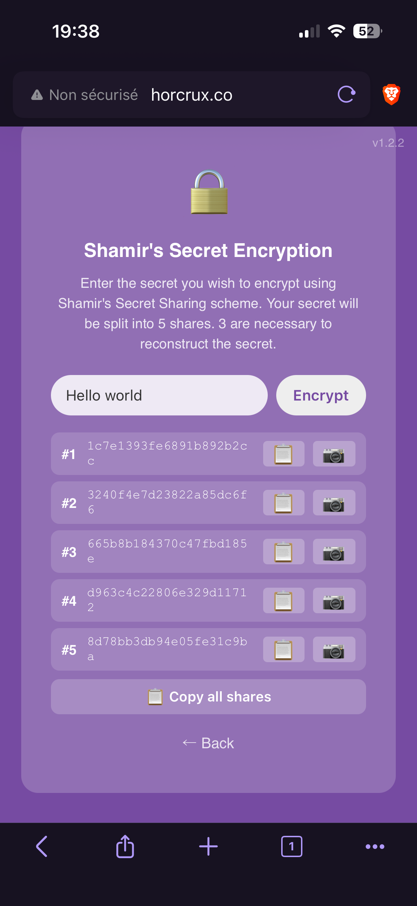

# 2. Create Shares

Once connected to the Horcrux, you'll be presented with two options: **split** or **unsplit**.

{ width="300" }

Because Horcrux is a captive portal, the app will automatically display on your phone as soon as you connect to the device. However, to unlock its full capabilities, **you should open it in your favourite web browser instead**. As mentioned on the main page of Horcrux, the link to get there is `horcrux.co`.

## Split your secret

The **split** option allows you to divide your secret into multiple pieces, called *shares*.

To do so, simply type (or paste) your secret into the text box, then tap the **split** button.

The letters and numbers that then appear are your shares. You must now save them somewhere safe.

{ width="300" }

## Save your shares

You have two ways to save your shares, depending on how you plan to use them.

### Save as text

The simplest option is to save the shares as plain text. Just copy them and store them wherever you keep your sensitive information.

This is a great option when you want to keep your shares close to you — for example, in a password manager, an encrypted note, or a physical backup you control.

{ width="300" }

### Save as a QR code

Text is convenient, but very hard to share with other people. That's why you also have the option to download a QR code, which stores your shares in a much easier format to share.

The QR code is generated on the fly and not stored in the device. This one can be scanned by any phone or tablet — perfect for printing out or sending to someone else (we will see later on what are the best ways to share them).

    

---

> Note: The screenshots in this guide may become outdated over time. They will be refreshed whenever significant updates are made to Horcrux.
